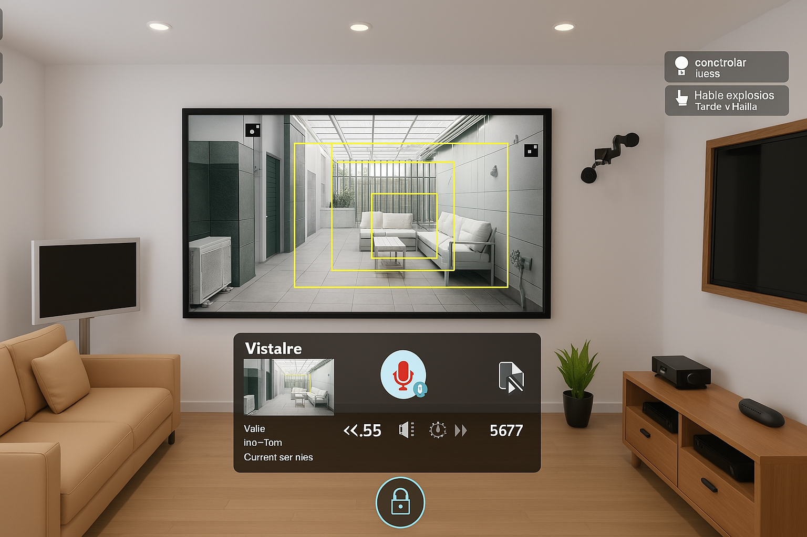

# AdaptDL: Real-Time Object Detection with Voice Commands


**AdaptDL** is a Python-based real-time object detection system using deep learning with voice commands for surveillance applications.

The system detects target objects from a webcam in real-time using a deep learning model, and overlays bounding boxes and labels on the detected objects in the video stream. It features functionality based on user-input voice commands, including selecting target objects, saving snapshots, and generating sound alerts. The system features with user preferences adaptability based on voice command history and can handle challenging environments.

<br/>
<p align="center">
&emsp;
</p>

## Features

- **Real-time Object Detection**: Detects objects in live video captured from a webcam using a deep learning model.
- **Bounding Boxes and Labels**: Overlays bounding boxes and labels on the detected objects in the video stream.
- **Voice Command Control**: Users can interact with the system through voice commands:
  - Select target objects.
  - Save snapshots of detected objects.
  - Generate sound alerts based on detection.
  <!-- - **SMS Alert**: Sends an SMS alert when certain objects are detected. -->
- **Adaptability**: The system adapts to user preferences and improves based on input voice command history and environmental challenges.

## Requirements

Install the following dependencies:

- Python 3.11 or higher
- OpenCV for video capturing and processing
- SpeechRecognition for voice command processing
- Pyaudio for microphone setup
  <!-- - Tensorflow 2.18 or higher, for deep learning model -->
  <!-- - Tensorflow Hub 0.13 or higher, for loading the pre-trained model -->
  <!-- - SSD MobileNet V2 model -->

## Installation

To install this project, please follow these steps:

1. Clone the repository:

   ```sh
   git clone https://github.com/OCR-tech/AdaptDL.git
   cd AdaptDL
   ```

2. Create a virtual environment:

   ```sh
   python -m venv .venv
   .\.venv\Scripts\Activate
   ```

3. Install the dependencies:

   ```sh
   pip install -r requirements.txt
   ```

<!-- # ssd-mobilenet-v2-tensorflow2-fpnlite-320x320-v1.tar -->
<!-- 4. Download the [SSD MobileNet V2 TensorFlow 2 model](https://tfhub.dev/tensorflow/ssd_mobilenet_v2/fpnlite_320x320/1) and extract the files into `app/models/pretrained_model/`. -->
   <!-- - Ensure the directory contains files like `saved_model.pb` and the `saved_model` folder. -->

## Usage

To run this project:

1. Run the main application:

   ```sh
   python .\app\main.py
   ```

2. The system will launch the webcam, and start detecting objects in real-time.
3. Use voice commands to interact with the system.

Voice Commands:

- "**Detect [Object Name]**": Detect specific objects (e.g., "Detect car").
- "**Stop [Object Name]**": Stop detecting specific objects (e.g., "Stop car").
- "**Save [Object Name]**": Save a snapshot of specific detected objects (e.g., "Save car").
- "**Help**": List available commands.
- "**Exit**": Exit the program.
<!-- - "**Detect**": Detect all objects in the model.
- "**Stop**": Stop detecting all objects.
- "**Alert**": Generate an alert sound when all objects are detected.
- "**Alert [Object Name]**": Generate an alert sound when specific objects are detected (e.g., "Alert person").
- "**Save**": Save a snapshot of all detected objects. -->

Keyboard Shortcuts:

- **Press 's'**: to save a snapshot with detected objects.
- **Press 'd'**: to detect specific objects.
- **Press 'h'**: to list available commands.
- **Press 'Esc'**: to exit the program.
  <!-- - **Press 'a'**: to generate an alert sound when specific objects are detected. -->
  The system adapts to user preferences over time based on input voice command history, improving accuracy and user experience.

## Customization

<!-- You can customize the system's behavior by modifying the configuration settings in the config.yaml file: -->

The system's behavior can be customized by modifying the configuration settings in the `config.py` file:

- **Target Object Settings**: Define which objects you want to detect.
- **Alert Settings**: Adjust sound alert thresholds and preferences.
- **Voice Command History**: Configure how the system adapts to voice command history.

## Contributing

For contributions, please follow these steps:

1.  Fork the repository
2.  Create a new branch (`git checkout -b feature-branch`)
3.  Commit your changes (`git commit -m "Added new feature"`)
4.  Push to the branch (`git push origin feature-branch`)
5.  Submit a pull request

## License

- This project is licensed under the [MIT License](LICENSE).

## Contact

We welcome any feedback, suggestions, or contributions to this project. For any inquiries, please contact us at:

- **Email**: ocrtech.mail@gmail.com
- **Website**: [https://ocr-tech.github.io/AdaptDL](https://ocr-tech.github.io/AdaptDL/)
- **GitHub**: [https://github.com/OCR-tech](https://github.com/OCR-tech)
